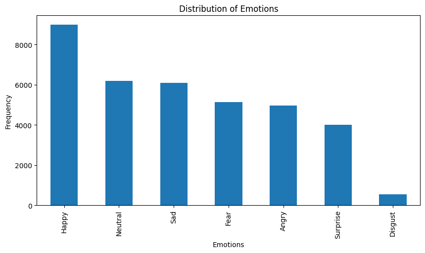
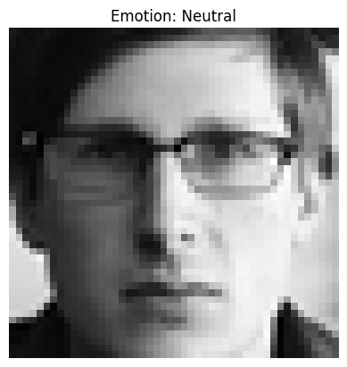
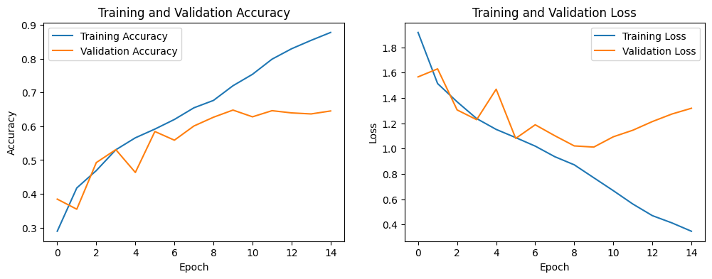
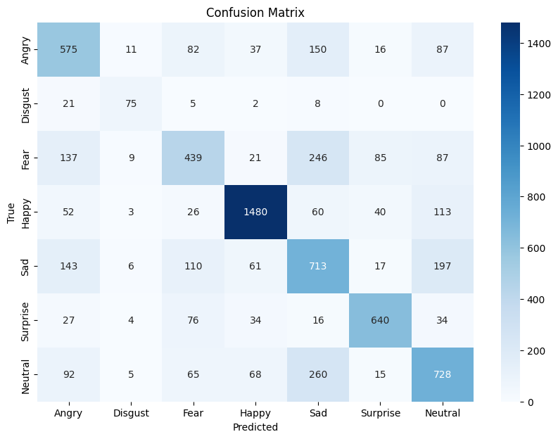
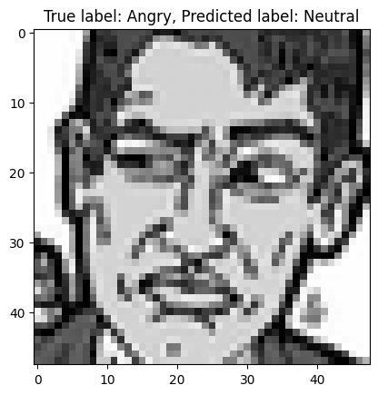

# Facial Emotion Tracking Capstone Project

## Introduction
This capstone project is about building a facial emotion tracking model that can predict human emotions from facial expressions. The model is trained on a dataset containing images of faces with labeled emotions. The goal is to help stakeholders like therapists, educators, and researchers better understand people's emotions in various contexts. This project includes a Jupyter notebook that walks through the process of data preparation, model building, and evaluation, as well as an app built with Streamlit that uses the trained model to make predictions on user-uploaded images.

## Data Understanding
The dataset used in this project contains grayscale images of faces with labeled emotions. The data is sourced from the "icml_face_data.csv" file, which is suitable for this project due to the diversity of emotions and facial expressions. The notebook presents the size of the dataset and descriptive statistics for all features used in the analysis, justifies the inclusion of features based on their properties and relevance, and identifies any limitations of the data that have implications for the project.

## Data Preparation
The notebook.ipynb file shows how the data is prepared for analysis. It includes instructions and code for loading and preprocessing the raw data, as well as comments and text to explain each step. The steps taken in data preparation are appropriate for the problem being solved.

## Modeling
The notebook.ipynb file showcases a step-by-step approach to building an emotion recognition model, starting with a simple baseline model and progressively experimenting with more complex architectures to improve performance. The process of building and refining the models is documented, with each change explained based on the results of previous models and the problem context. The improvements achieved through experimentation are also discussed.

Initially, we tried a simple CNN model with two convolutional layers followed by max-pooling, a fully connected dense layer, and an output layer. A grid search was performed to optimize hyperparameters like number of filters, filter sizes, dense layer units, and dropout rates. However, this model did not yield satisfactory results.

Next, we built a more complex CNN model that incorporated six convolutional layers with batch normalization and three max-pooling and dropout layers. We carried out an extensive grid search to find the best combination of hyperparameters, including the number of filters, filter sizes, dense layer units, and dropout rates, among others. This model achieved better results with a test loss of 1.0121 and test accuracy of 0.6478.

Finally, we experimented with a pre-trained MobileNetV2 model as a feature extractor, combined with custom layers specifically tailored for the emotion analysis task. Although this model performed better than the first simple CNN model, our final model with six convolutional layers still achieved the best overall results.

## Evaluation
The notebook.ipynb file shows how well the final model solves the real-world problem. The choice of evaluation metrics is justified using the context of the real-world problem and the consequences of errors. One final model is identified based on its performance on the chosen metrics with validation data. The performance of the final model is evaluated using holdout test data.

The results for the final model (v2) are as follows:
- Test loss (v2): 1.0121
- Test accuracy (v2): 0.6478

### The confusion matrix for the final model (v2) is shown below:

### Sample of Bad Prediction

## Conclusion
Throughout this project, we've learned valuable lessons in building a facial emotion recognition system using deep learning. We started with a simple CNN model and iteratively improved it by experimenting with different architectures and hyperparameters. The final model achieved a test accuracy of 0.6478, showing its potential to solve the real-world problem of emotion recognition.

However, there's still room for improvement. Some of the key takeaways and future directions to enhance the model's performance are:

1. Data augmentation: To improve the model's generalization capabilities, we can augment the dataset by applying random transformations such as rotation, flipping, and zooming on the training images. This will help the model to learn more varied representations of facial emotions.

2. Larger and more diverse dataset: The current dataset may not cover all possible variations of human emotions. By using a larger and more diverse dataset, the model can learn to recognize a wider range of facial expressions and adapt to different lighting conditions, camera angles, and facial structures.

3. Transfer learning: We experimented with MobileNetV2 as a feature extractor, but other pre-trained models like VGG16, ResNet, or InceptionV3 could also be explored. Leveraging these models, pre-trained on large-scale datasets like ImageNet, can help improve the model's feature extraction capabilities and lead to better performance.

4. Model ensembling: Combining the predictions from multiple models with different architectures can improve the overall performance of the system. By averaging the predictions or using techniques like stacking or voting, the ensemble model can potentially outperform individual models.

5. Hyperparameter optimization: Although we conducted a grid search for hyperparameter tuning, more advanced techniques such as Bayesian optimization or genetic algorithms can be used to find a better combination of hyperparameters that lead to improved performance.

In conclusion, this project has provided us with a strong foundation for building facial emotion recognition systems. By applying the lessons learned and exploring the suggested improvements, we can continue to refine the model and create a more robust and accurate system for real-world applications.S